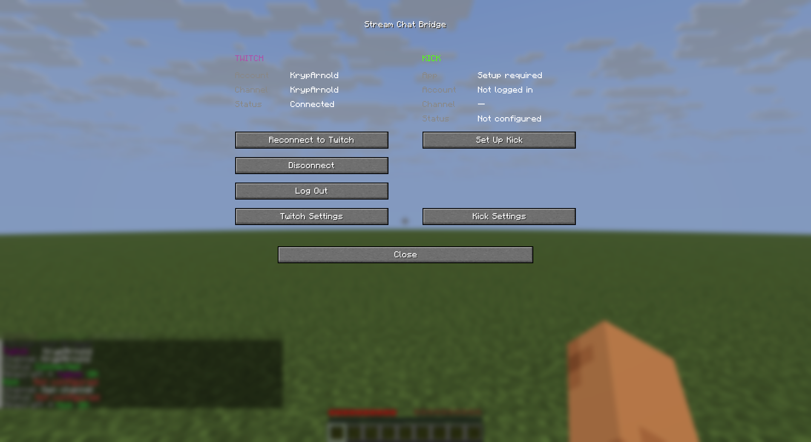

# Stream Chat Bridge

Bridges Minecraft chat with **Twitch** and **Kick**. Your in-game chat goes to your
stream, and stream chat appears in Minecraft with platform colors, badges, mention
highlights and configurable message formats.

Available on Modrinth: **https://modrinth.com/mod/stream-chat-bridge**

## Features

- **Two-way bridge** for Twitch (EventSub WebSocket) and Kick (Pusher WebSocket)
- **Rich chat display**: platform colors, badges (streamer, mod, VIP, sub, founder),
  mention highlighting with optional sound, per-platform message formats
- **Prefix-based sending** from Minecraft chat: `t!` sends to Twitch, `!k ` to Kick
  (both configurable; unmatched messages stay local)
- **F8 dashboard**: Twitch/Kick login (device flows), channel selection, message
  formats, chat toggles and reconnect/log-out controls
- **Quiet by default**: staff-only badges and errors-only join status, both toggleable
- Client-side only; works in singleplayer and on servers

## Screenshots

The F8 dashboard (login, channels, per-platform settings and chat toggles):



## Supported versions

One mod build per loader covers a whole Minecraft range (see the tag on each file):

| Loader   | Minecraft        |
|----------|------------------|
| Fabric   | 1.17.1 – 26.3    |
| Forge    | 1.17.1 – 26.3    |
| NeoForge | 1.20.4 – 26.3    |

## Installation

1. Install Fabric, Forge or NeoForge for your Minecraft version.
2. Download the matching jar from [Modrinth](https://modrinth.com/mod/stream-chat-bridge).
   On Fabric, [Fabric API](https://modrinth.com/mod/fabric-api) is required.
3. Drop the jar into your `mods` folder and launch the game.
4. Press **F8** in-game to connect your Twitch and/or Kick account.

## Configuration

- Settings: `.minecraft/config/streamchatbridge.json`
- Secrets (tokens) are stored outside the mod config, in the per-user config
  directory: `%APPDATA%\streamchatbridge\` on Windows
  (`~/Library/Application Support/streamchatbridge` on macOS,
  `$XDG_CONFIG_HOME/streamchatbridge` on Linux).
- Default prefixes: `t!` for Twitch, `!k ` for Kick. Both are configurable in the
  F8 dashboard together with channels, formats and chat toggles.

## Building from source

Multi-loader build powered by [Stonecutter](https://stonecutter.kikugie.dev/);
the shared sources build for every loader and Minecraft era (37 nodes, 1.17.1 through
26.3). JDK 25 runs the Gradle daemon; era-specific run JDKs are selected automatically.

```powershell
.\gradlew.bat --no-daemon --no-configuration-cache :26.3-fabric:buildAndCollect
.\gradlew.bat --no-daemon --no-configuration-cache :26.3-forge:buildAndCollect
.\gradlew.bat --no-daemon --no-configuration-cache :26.3-neoforge:buildAndCollect
```

`buildAndCollect` copies the jar and sources jar into `build/libs/<mod version>/`.

## License

MIT, see [LICENSE](LICENSE).
